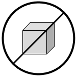

# Containerless #

Tired of JavaScript all the time?

Does your application not quite work in the constraints of the serverless future?

What if your Ruby/Go/Idris/Whatever application was almost (but not quite) as easy to deploy as a Lambda function?

Introducing `containerless`

Simple, declaratively configured container deployments for AWS.

Warning: may contain containers. Also, docker.





## Installation ##

Inside your serverless project:

```
yarn add containerless
```

Add the following to serverless.yml:

```
plugins:
  - containerless
```


## Commands ##

Configured Applications will be added to the stack as part of the serverless deploy command.

When deploying, you should provide the appropriate docker image tag to use

`sls deploy --noDeploy --tag hello-world-1`

### Building ###

Containerless provides the `cls-build` command to build and push a set of docker images to the nominated repostory.

Each application is assumed to have a `Dockerfile`, and to be in a directory inside the serverless parent project.

```
sls cls-build

sls cls-build --tag hello-world-1
```

If a tag is not provided, a tag in the form `{app-name}-{timestamp}` is generated and used.


## Configuration ##

Configuration lives in a `custom.containerless` namespace in your `serverless.yml`

Containerless can use an existing ECS Cluster or can be configured to create a new cluster.

Minimal Configuration Example

```
custom:
  containerless:    
    cluster:
      vpcId: vpc-000000000001
      subnets:
        - sg-000000000001
        - sg-000000000002
    repository: 000000000000.dkr.ecr.ap-southeast-2.amazonaws.com/containerless
    stage: dev
    applications:
      hello-world
```

### Cluster ###

Required fields:

 - vpcId
 - subnets

A vpcId and one or more subnets in that VPC are required.
If using an existing cluster, provide the VPC and subnets that the cluster has been created in.
You can also use privateSubnets option (example below).

If you need to define a VPC, a sample CloudFormation template is provided in `examples/vpc.cfn.yml`.
You can use the


### Use Existing Cluster ###

Required Fields:

- id (as aws arn)
- security_group

If an existing cluster id is provided, a security group is required in order to configure a load balancer for mapping URLs to containers. Please see below for more details.

Existing Cluster Configuration Example

```
custom:
  containerless:    
    cluster:
      id: arn:aws:ecs:ap-southeast-2:000000000000:cluster/ECSCluster
      vpcId: vpc-000000000001      
      subnets:
        - sg-000000000001
        - sg-000000000002
      protocol: HTTPS
    repository: 000000000000.dkr.ecr.ap-southeast-2.amazonaws.com/containerless
```

### Create New Cluster ###

Optional fields:

 - capacity (defaults to 1)
 - instance_type (defaults to 't2.micro')
 - region (defaults to 'ap-southeast-2')
 - size (defaults to 1)

A new cluster will be created in an AutoScalingGroup. Capacity is the DesiredCapacity of the ASG. Please refer to AWS docs for details.

New Cluster Configuration Example

```
custom:
  containerless:    
    cluster:
      region: us-west-2
      capacity: 3
      vpcId: vpc-000000000001      
      subnets:
        - sg-000000000001
        - sg-000000000002
      privateSubnets:
        - sg-000000000001
        - sg-000000000002
    repository: 000000000000.dkr.ecr.ap-southeast-2.amazonaws.com/containerless
```

If you need you can also use privateSubnets option. Example below.

### Load Balancer ###

The ALB will default to HTTP, but either or both HTTP and HTTPS can be specified in the cluster properties. The default ports of 80 and 443 will be used.  

```
cluster:
  protocol:
    - HTTP
    - HTTPS
```

If you use HTTPS, you will also need to add the ARN of a valid certificate to the cluster config.

```
cluster:
  certificate: arn:aws:acm:region:account:certificate/id
```

Note: these are the end-user public facing ports, not the ports that are mounted by a docker image, these are mapped internally by the Cluster.


### Applications ###

Each application requires a `Dockerfile` with the relevant docker setup.
Please refer to the examples provided for more details.

Fields:
  - src (if not provided will default to the application name)  
  - memory (defaults to 128)
  - url
  - healthcheckPath (optional, default: `/`)
  - port
  - environment (optional array of key/values)

In order to map to the load balancer applications need to provide both a URL and Port.

If url and port are omitted, the application will not be routed, and will be run as a task in the container.

Ports do not have to be unique, the system will dyanmically map ports to the docker container.

You can use any valid AWS Application Load Balancer path pattern as the URL. You can also provide path for your application healthcheck (default `/`).

Only one application can be mounted to the root url '/', because of the way in which the load balancer routes paths.
Other applications will be routed based on a pattern, and you will need to remember to mount your application on that route as the load balancer forwards the whole url.

For example, requests to the url `/hello` will be forwarded to the application retaining the `/hello` path, so your application needs to handle this.


```
custom:
  containerless:
    applications:
      hello-1:
        url: /
        port: 3000
        memory: 256
      hello-2:
        src: src-2
        url: /hello
        healthcheckPath: /_health
        port: 3000
        environment:  
          - KEY: 'value'
      hello-3
```


### Security Group ###

If you are using an existing ECS Cluster, the load balancer needs to be part of a security group that can route traffic to the Cluster Instances on the ephermeral port range used to map to docker containers.

Sample Security Group Configuration

```
{
  'Type': 'AWS::EC2::SecurityGroupIngress',
  'Properties': {
    'IpProtocol': 'tcp',
    'FromPort': 31000,
    'ToPort': 61000,
    'GroupId': {
      'Ref': 'ContainerlessSecurityGroup'
    },
    'SourceSecurityGroupId': {
      'Ref': 'ContainerlessSecurityGroup'
    }
  }
```


### Handy Hint ###

CloudFormation can export parameters that can be consumed by other cfn stacks, which makes using Resources in those stacks much simpler.

For example, in your VPC configuration you can export VpcId and Subnet parameters:

```
Outputs:
  VpcId:
    Description: VPC ID
    Value:
      Ref: Vpc
    Export:
      Name:
        Fn::Sub: "${AWS::StackName}-VpcID"
```


And then import these into your containerless configuration:

```
cluster:
  vpcId:
    Fn::ImportValue: vpc-VpcID
  subnets:
    - Fn::ImportValue: vpc-PublicSubnetAz1
    - Fn::ImportValue: vpc-PublicSubnetAz2
    - Fn::ImportValue: vpc-PublicSubnetAz3
```

The sample VPC CloudFormation template provided in `examples/vpc.cfn.yml` sets these exports up for you.


## Contributing ##

This project has been written in typescript, which means you need to edit the `.ts` files, not the generated JavaScript files.

The Atom Typescript plugin is *ace*.
